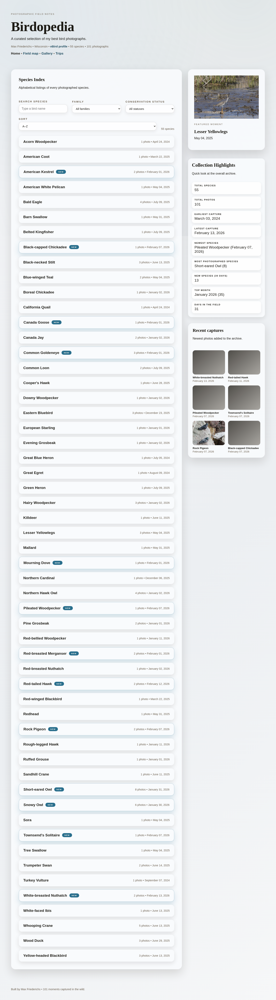
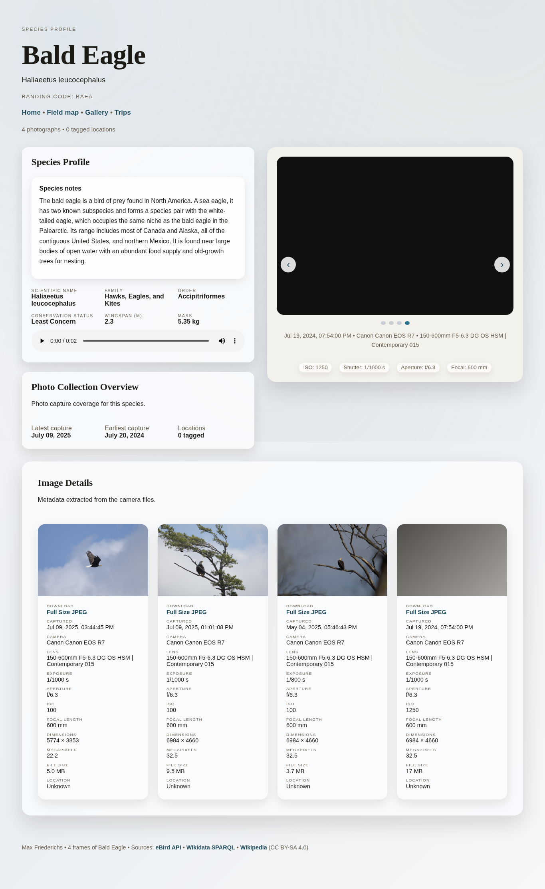
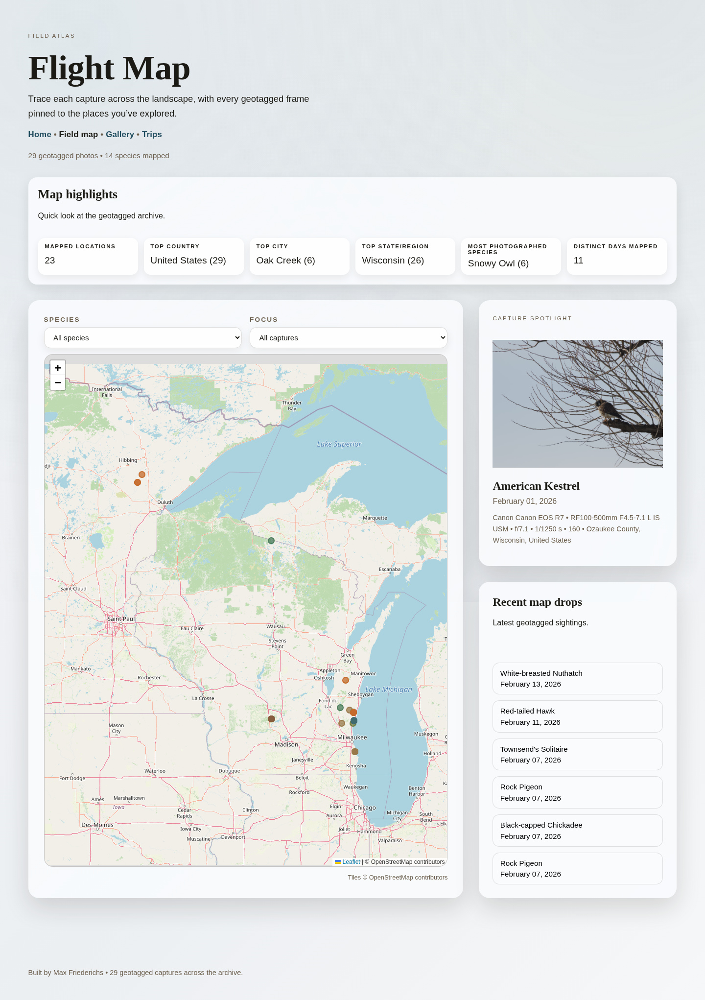

# Birdopedia

A static, photography-first bird website generated from your own images and metadata.

Birdopedia is designed for photographers: add species folders and photos, run a data fetch + build, then deploy `public/` to any static host.

## What It Generates

- A home/index page with all species, sorted alphabetically.
- A species page per bird with eBird taxonomy and conservation context.
- Wikipedia/Wikidata summary facts.
- Rich image metadata (capture date/time, camera/lens, dimensions, file size, GPS-based location where available).
- A field map view based on geotagged photos.
- A cross-species gallery view.
- A trips view inferred from clustered captures.

Output is written under `public/`, including `public/index.html` and `public/birdopedia/**`.

## Screenshots

Home page:



Species page:



Field map page:



## Quick Start

1. Install dependencies.

```bash
npm install
```

2. Configure author/site metadata in `config.json` (or start from `sample.config.json`).

3. Create `.env` with at least your eBird API token:

```bash
EBIRD_API_TOKEN=your_key_here
```

Optional `.env` values:

- `GEOCODE_EMAIL=you@example.com` for reverse geocoding attribution with Nominatim.
- `PORT=3000` for local server port.
- `DEPLOY_TARGET=user@host:/path/to/site` for `deploy.sh`.
- `DEPLOY_DELETE=true` to delete remote files not present locally during deploy.
- `DEPLOY_DRY_RUN=true` to preview deploy changes.

4. Fetch external data and cache it in `data/*.json`.

```bash
npm run fetch:data
```

5. Build the static site.

```bash
npm run build
```

6. Serve locally.

```bash
npm start
```

Open `http://localhost:3000`.

## Content Workflow

### Add A New Species

1. Create a folder under `public/img/` named as the species common name.

```text
public/img/Red-breasted Nuthatch/
```

2. Add images (`.jpg`, `.jpeg`, `.png`, `.webp`).

3. Refresh data and rebuild:

```bash
npm run fetch:data
npm run build
```

If a folder name does not map cleanly to eBird, add an override in `data/ebird.overrides.json` under `byFolder`.

### Add Photos To An Existing Species

1. Drop the new files into the species folder in `public/img/`.
2. Rebuild:

```bash
npm run build
```

If you want fresh eBird/Wikidata/Wikipedia/geocoding cache, run `npm run fetch:data` first.

## Commands

- `npm run fetch:data` runs `scripts/fetch-data.js` and updates `data/ebird.json`, `data/wikidata.json`, `data/wikipedia.json`, and `data/geocode.json`.
- `npm run build` runs `scripts/build.js` and regenerates pages/assets in `public/`.
- `npm start` runs `server.js` to serve `public/`.

Useful flag:

- `node scripts/fetch-data.js --hard` forces a full refresh instead of reusing cached entries.

## Project Structure

```text
config.json               # Author/site config used in generated pages
.env                      # API/deploy/local-server environment variables
data/                     # Cached fetched data + overrides
public/img/<Bird Name>/   # Source photos grouped by species
templates/                # JS/CSS used by generated pages
scripts/fetch-data.js     # Fetches eBird + Wikidata + Wikipedia + geocoding
scripts/build.js          # Builds all static pages from images + cached data
server.js                 # Local static file server
deploy.sh                 # Rsync deploy helper for public/
```

## Deploy

`deploy.sh` syncs `public/` to `DEPLOY_TARGET` via `rsync`:

```bash
./deploy.sh
```

Common deploy modes:

- Safe preview: set `DEPLOY_DRY_RUN=true`.
- Mirror remote to local output exactly: set `DEPLOY_DELETE=true`.

## Notes

- `public/` is generated output plus your source photo folders in `public/img/`.
- Re-run `npm run build` any time photos or templates change.
- Re-run `npm run fetch:data` when you want updated external species/location content.
